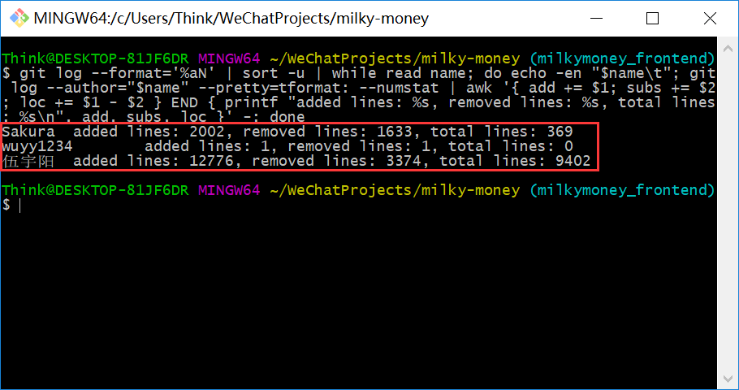

# Information

16340244

伍宇阳

github:wuyy1234

# 课程学习自我总结

这是我做的第一个正式上线的应用，总的来说是一个小小小的里程碑吧。之前的项目都是内部自己做个demo玩玩，这个终于做了个可以公开的小程序（虽然只会有项目内部成员和腾讯的审核官会用）。这个项目的可发挥余地很大，模拟了一个比较真实的应用场景，要做的简单还是复杂到爆炸全凭团队的构想。还是比较庆幸团队的氛围还可，每周都能做到开例会讨论面对面解决问题，在这一点上我觉得比很多小组做的好。有时候面对面交流是一个更加高效的方式，虽然不一定能讨论什么技术细节，但是通过交流可以很轻松地化解成员之间的矛盾和误解，这无疑对一个有执行力的团队是至关重要的。

我负责的工作是小程序UI,UX的实现以及业务代码的编写和部分测试，这是我第二次接触和使用前端技术，上一次还是大二上的王青老师的web2.0。不得不说，把理论用到实践还是有很长的路要走，实现简单的模块和架构依然需要大量依赖与别人的工作成果，自己距离深入了解前端依然有很长的路要走。通过这次的实践，深知写业务代码的繁杂琐碎，各种细节需要精雕细琢，软件缺陷层出不穷，距离蔡国扬老师的软件缺陷的控制目标依然遥远。但是这是一个开始，这是软件工程专业作为工程类专业的精髓之一，其在工程与技术指标和质量上的控制正是这个学科所追求的目标，兴许在经过实践之后会对于这些概念有更深的体会。

### 设计

这块的设计主要是根据队友提供的UI设计思路进行实现，对于具体的实现，主要参考一个网上的开源设计库```vant-ui```的实现，对于具体的业务进行修改。

### 开发

这块的开发主要是基于微信小程序，一方面是在开发测试的时候方便，另一方面在终端适配和后期维护上也更胜一筹。

### PSP2.1 表格

||Personal Software Process Stages|Time (%)|
|:--:|:--:|:--:|
|**Planning**|**计划**|**10**
|estimate|预估任务时间|10
|**Development**|**开发**|**80**
|analysis|需求分析|10
|design spec|生成设计文档|5
|estimate|设计复审（与后端团队成员审核设计文档）|6
|coding standard|代码规范|2
|design|具体设计，包括绘制 UI，设计架构等|15
|coding|具体编码|22
|code review|代码复审|5
|test|测试（修改代码）|15
|**Report**|**报告**|**10**
|test report|测试报告|1
|size measurement|计算工作量|1
|postmortem& process improvement plan|每次迭代结束后写总结文档，并提出改进计划|8

### 最得意/或有价值/或有苦劳的工作清单

- 最得意：根据设计制作出与预期基本相符的小程序前端
- 最有价值：与团队每周保持高效的例会沟通，确保所有成员的工作进度与困难成果都彼此了解
- 最苦劳：前端与后端API在前期由于开发进度不同，没有实现统一，最后对API和DEBUG花了不少时间。

### 个人git总结
#### Dashboard 文档集合


#### 前端开发

git用户名为```伍宇阳```以及```wuyy1234```


### 个人博客
[初步解析小程序前端框架vant-ui源码](https://blog.csdn.net/wuyy75/article/details/90920094)

### 特别致谢
- 后端大佬，吴天扬，一个人完成后端搭建与配置上线
- 测试小伙伴，吴聪，协助前端测试工作，帮我节省了大量时间
- API设计，伍兆贤，设计了高可用性的API方便前后端对接
- 文档与产品设计，吴良澔，文档详尽，帮助团队高效运行